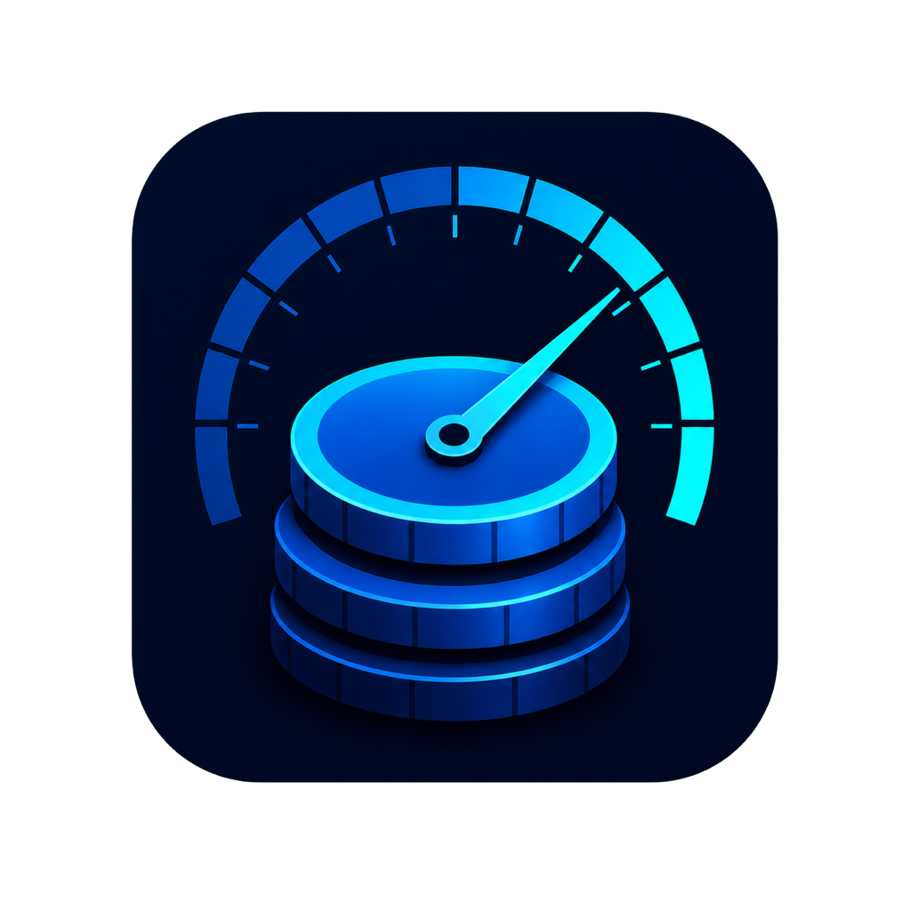

<p align="center">
  
</p>

<h1 align="center">TokenMeter</h1>

<p align="center">
  A native macOS menu bar app for tracking local AI coding token usage, estimated cost, and Codex quotas.
</p>

TokenMeter gives Claude Code, Codex, and OpenCode users one lightweight view of their local usage. It runs without a Dock icon, refreshes automatically, and keeps usage processing on the Mac.

## Features

- Tracks Claude Code usage from local JSONL session logs.
- Tracks Codex usage and model-aware estimated cost from local sessions, including side and temporary chats found only in the local SQLite log database.
- Reads OpenCode assistant usage from its local SQLite database, including live WAL data.
- Shows Codex rolling quota windows and reset timing.
- Aggregates daily, weekly, monthly, and all-time token counts, calls, and cost.
- Breaks down mixed-source totals in field-level hover details.
- Uses incremental caches for quick refreshes after the first scan.
- Supports USD and CNY price tables through `Resources/pricing.json`.

## Requirements and compatibility

| Requirement | Support |
| --- | --- |
| macOS | macOS 13 Ventura or later |
| GitHub Release CPU support | Universal binary: Apple Silicon (`arm64`) and Intel (`x86_64`) |
| Source build tools | Xcode Command Line Tools with Swift 5.9 or later |

TokenMeter is a menu bar app (`LSUIElement`) and does not show a Dock icon.

## Install

### 1. Download from GitHub Releases

1. Open the [TokenMeter Releases page](https://github.com/hzcsj/token-meter/releases).
2. Download `TokenMeter-v0.2.1-macos-universal.zip` and `SHA256SUMS`.
3. Optionally verify the download from the directory containing both files:

   ```bash
   shasum -a 256 -c SHA256SUMS
   ```

4. Unzip the archive and move `TokenMeter.app` to `/Applications`.
5. Open TokenMeter. Use **设置与退出…** to control **随系统启动**, or quit with `⌘Q`.

See [Signing, notarization, and Gatekeeper](#signing-notarization-and-gatekeeper) before the first launch.

### 2. Build and install from source

```bash
git clone https://github.com/hzcsj/token-meter.git
cd token-meter
bash scripts/install.sh
```

The source installer builds for the current Mac architecture, installs `/Applications/TokenMeter.app`, and creates the `io.github.hzcsj.tokenmeter` LaunchAgent. First installs enable login start by default. Later installer runs preserve an explicit disabled choice made in the app. Upgrading also removes the legacy `com.user.tokenmeter` LaunchAgent to prevent duplicate processes.

To create a release bundle without installing anything or changing `launchctl` state:

```bash
bash scripts/package.sh --arch universal --output-dir dist
```

This produces `dist/TokenMeter.app` and `dist/TokenMeter-v0.1.0-macos-universal.zip` without writing to `/Applications`.

## Signing, notarization, and Gatekeeper

The v0.1.0 public artifacts are **not signed with an Apple Developer ID and are not notarized by Apple**. Gatekeeper may therefore block the first launch of a downloaded build.

Do not disable Gatekeeper globally. In Finder, Control-click `TokenMeter.app`, choose **Open**, then confirm **Open**. If macOS still blocks the app, review it under System Settings → Privacy & Security.

## Privacy

TokenMeter scans supported logs and databases locally and read-only:

- Claude Code and Codex JSONL logs are opened for local parsing only.
- Codex and OpenCode SQLite databases are opened in read-only mode; TokenMeter does not checkpoint or mutate their WAL files.
- Token usage, prompts, logs, and derived cost data are not uploaded by TokenMeter.
- The incremental usage cache remains local under `~/Library/Caches/token-meter/`.

The app contains no telemetry or analytics service. Its bundled pricing table is local.

## How it works

Every five minutes TokenMeter:

1. Scans Claude Code assistant messages in `~/.claude/projects/**/*.jsonl`.
2. Scans Codex sessions in `~/.codex/sessions/**/*.jsonl` and supplements them with deduplicated side or temporary chats from `~/.codex/logs_2.sqlite`.
3. Reads OpenCode assistant messages from `~/.local/share/opencode/opencode.db` using a read-only SQLite connection.
4. Calculates virtual cost using the bundled pricing table.
5. Updates the menu bar summary, detailed history, and Codex quota windows.

Set `OPENCODE_DB_PATH` to override the default OpenCode database location. Missing, corrupt, or incompatible rows are skipped without preventing the other sources from loading.

## Pricing

Model prices are defined in `Resources/pricing.json`:

- `models_usd_per_mtok` contains Claude, Gemini, Qwen, GLM, DeepSeek, and other model rates; CNY entries declare `currency: "CNY"`.
- `codex_models_usd_per_mtok` contains Codex/GPT rates.
- `long_context_threshold` and `long_*` contain optional long-context rates.
- `cache_write` and `service_tier_multipliers` describe Codex cache writes and per-model `fast`/`priority` rates.

Virtual costs use official on-demand API rates, including publicly advertised model-wide pricing such as the GPT-5.6 Sol promotion (available at least through November 21, 2026; no automatic expiry is assumed). Batch/Flex discounts, regional uplifts, and time-based cache-storage charges are excluded. Sonnet 5 remains $2/$10 per million input/output tokens; its planned September increase was canceled. Models whose names contain `dogfooding` are counted but remain free.

The September 5, 2026 catalog adds GPT-6 Astra and Claude Fable/Mythos 5.1. GPT-6 Astra costs $10 input / $1 cache read / $12.50 cache write / $50 output per million tokens, with long-context rates above 272K input tokens and 2× API Fast/Priority rates. Fable/Mythos 5.1 cost $10 input / $50 output with $0.25 cache reads; their 5m/1h cache-write rates remain $12.50/$20. Sources: [OpenAI pricing](https://developers.openai.com/api/docs/pricing), [OpenAI changelog](https://developers.openai.com/api/docs/changelog), and [Anthropic pricing](https://platform.claude.com/docs/en/about-claude/pricing).

### Historical pricing

`price_history` stores prior rates with exclusive `effective_until` cutoffs. Claude, Codex, and OpenCode pass each usage record's timestamp to the pricing engine; the earliest matching cutoff is selected after resolving the exact model or longest variant prefix. Only models listed in a revision are overridden, so a new model never inherits an unrelated old fallback.

- Terra/Luna retain prior prices before July 30, 2026.
- Sol (including the `gpt-5.6` alias) retains $5/$30 before August 21, then uses $4/$20.
- From July 30, GPT-5.6 `fast` and `priority` both use 2× API rates. Earlier catalog estimates are retained.
- Official announcements specify dates without an exact time; cutoffs use 00:00 UTC (08:00 Asia/Shanghai).

When updating an existing price, append a dated revision containing the **complete previous rate entry** before editing the current table; never overwrite earlier revisions. The catalog fingerprint automatically invalidates cost caches. A rebuild uses event-time prices, not today's prices for all records. Existing cache files are left intact. Earlier unverified price history retains the previous catalog baseline; correcting a missing model or a counting bug can still change past estimates. These are virtual API-equivalent costs, not subscription bills. Provider-specific verification dates are recorded in `_meta.provider_last_verified`.

## Development

```bash
swift test
swift build -c release
bash -n scripts/*.sh
```

Release metadata is centralized in `scripts/app-config.sh`. A Git tag must match the configured app version before the release workflow packages and retains its release assets. Publishing the public GitHub Release remains a separate, explicit step.

## Uninstall

```bash
launchctl unload ~/Library/LaunchAgents/io.github.hzcsj.tokenmeter.plist 2>/dev/null || true
rm -f ~/Library/LaunchAgents/io.github.hzcsj.tokenmeter.plist
rm -rf /Applications/TokenMeter.app
rm -rf ~/Library/Caches/token-meter/

# Legacy pre-v0.1.0 LaunchAgent cleanup, if still present
launchctl unload ~/Library/LaunchAgents/com.user.tokenmeter.plist 2>/dev/null || true
rm -f ~/Library/LaunchAgents/com.user.tokenmeter.plist
```

## License

[MIT](LICENSE)
